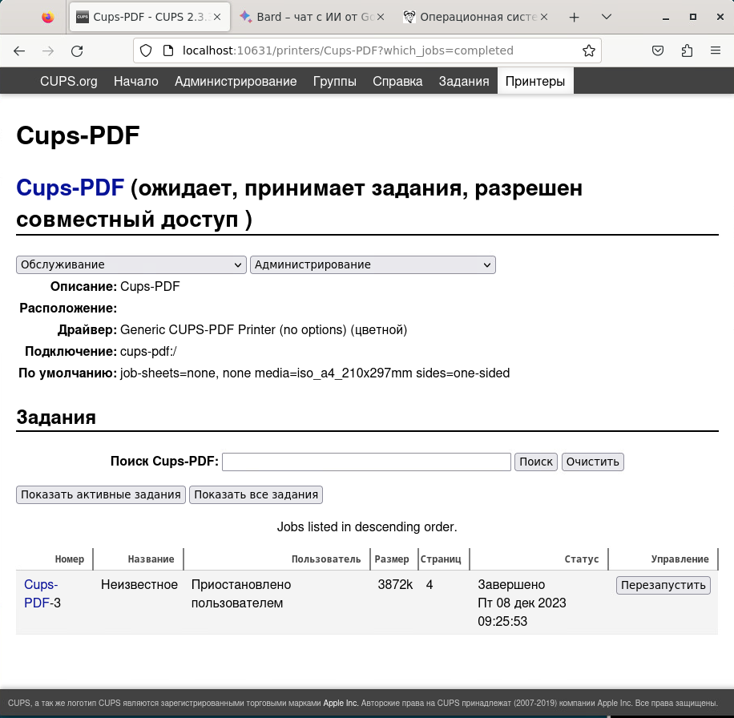
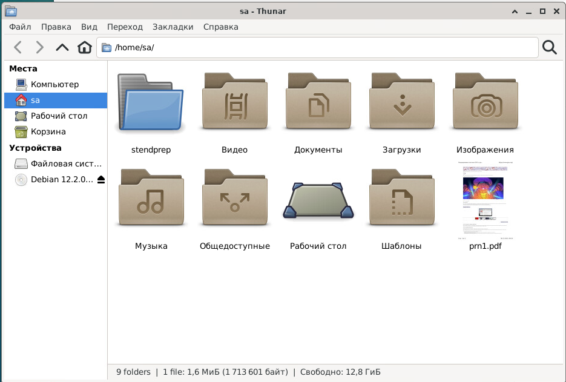

## LAB04-2. Настройка сервера печати. Добавление общего принтера

### 1. Установка службы печати

Для выполнения практики понадобится сервер (в инструкции используется имя `s1-alma`, вы можете использовать свои имена) и клиент(в инструкции используется имя `s2-deb`, вы можете использовать свои имена).

1. **Подключитесь к серверу `s1-alma`**
Установите службу CUPS
```bash
sudo dnf install cups
```

или

```bash
sudo apt install cups
```

Пример сообщения в терминале:

```console
Зависимости разрешены.
======================================================================================================================================================
Пакет                                           Архитектура                 Версия                                Репозиторий                  Размер
======================================================================================================================================================
Установка:
cups                                            x86_64                      1:2.4.2-10.fc37                       updates                      1.5 M
Установка зависимостей:
antiword                                        x86_64                      0.37-34.fc37                          fedora                       168 k
avahi-glib                                      x86_64                      0.8-18.fc37                           updates                       15 k
color-filesystem                                noarch                      1-29.fc37                             fedora                       8.2 k
colord                                          x86_64                      1.4.6-2.fc37                          fedora                       549 k
colord-libs                                     x86_64                      1.4.6-2.fc37                          fedora                       233 k
cups-client                                     x86_64                      1:2.4.2-10.fc37                       updates                       71 k
cups-filesystem                                 noarch                      1:2.4.2-10.fc37                       updates                       12 k

...

nss-mdns                                        x86_64                      0.15.1-6.fc37                         fedora                        46 k

Результат транзакции
======================================================================================================================================================
Установка  27 Пакетов

Объем загрузки: 12 M
Объем изменений: 40 M
Продолжить? [д/Н]:
```
...
```console
Проверка         : qpdf-libs-10.6.3-5.fc37.x86_64                                                                                                          27/27

Установлен:
antiword-0.37-34.fc37.x86_64                           avahi-0.8-18.fc37.x86_64                             avahi-glib-0.8-18.fc37.x86_64
color-filesystem-1-29.fc37.noarch                      colord-1.4.6-2.fc37.x86_64                           colord-libs-1.4.6-2.fc37.x86_64
cups-1:2.4.2-10.fc37.x86_64                            cups-client-1:2.4.2-10.fc37.x86_64                   cups-filesystem-1:2.4.2-10.fc37.noarch
cups-filters-1.28.16-3.fc37.x86_64                     cups-filters-braille-1.28.16-3.fc37.x86_64           cups-filters-libs-1.28.16-3.fc37.x86_64
cups-ipptool-1:2.4.2-10.fc37.x86_64                    ghostscript-9.56.1-7.fc37.x86_64                     ghostscript-tools-fonts-9.56.1-7.fc37.x86_64
ghostscript-tools-printing-9.56.1-7.fc37.x86_64        liberation-fonts-common-1:2.1.5-3.fc37.noarch        liberation-mono-fonts-1:2.1.5-3.fc37.noarch
libexif-0.6.24-3.fc37.x86_64                           liblouis-3.24.0-1.fc37.x86_64                        liblouis-utils-3.24.0-1.fc37.x86_64
liblouisutdml-2.11.0-2.fc37.x86_64                     liblouisutdml-utils-2.11.0-2.fc37.x86_64             nss-mdns-0.15.1-6.fc37.x86_64
poppler-cpp-22.08.0-3.fc37.x86_64                      poppler-utils-22.08.0-3.fc37.x86_64                  qpdf-libs-10.6.3-5.fc37.x86_64

Выполнено!
```

или

```
sa@s2-deb:~$ sudo apt install cups

Чтение списков пакетов… Готово
Построение дерева зависимостей… Готово
Чтение информации о состоянии… Готово
Уже установлен пакет cups самой новой версии (2.4.2-3+deb12u4).
cups помечен как установленный вручную.
Обновлено 0 пакетов, установлено 0 новых пакетов, для удаления отмечено 0 пакетов, и 0 пакетов не обновлено.

```


2. Проверьте статус службы CUPS
```bash
systemctl status cups.service
```

3. Если она не выполняется, запустите службу и добавьте ее в автозапуск при перезагрузке сервера.
```bash
sudo systemctl enable --now cups
```

4.  Проверьте статус службы CUPS. Должно быть как в примере:
```console
● cups.service - CUPS Scheduler
     Loaded: loaded (/usr/lib/systemd/system/cups.service; enabled; preset: disabled)
     Active: active (running)
```

5. Уточните на каком порту служба "слушает запросы. Найдите строку с "cupsd" и запомните номер порта в столбце `Local Address:Port`
```bash
sudo ss -tlnp4
```

Пример сообщения в терминале:

```
sa@s2-deb:~$ sudo ss -tlnp4
State     Recv-Q    Send-Q       Local Address:Port         Peer Address:Port    Process
LISTEN    0         4096               0.0.0.0:222               0.0.0.0:*        users:(("conmon",pid=1086,fd=6))
LISTEN    0         4096               0.0.0.0:80                0.0.0.0:*        users:(("conmon",pid=1086,fd=5))
LISTEN    0         128                0.0.0.0:22                0.0.0.0:*        users:(("sshd",pid=712,fd=3))
LISTEN    0         128              127.0.0.1:631               0.0.0.0:*        users:(("cupsd",pid=1866,fd=7))

```

6. Проверьте ответ сервиса CUPS по http-протоколу:
```bash
curl localhost:<_НОМЕР_ПОРТА_из_шага_5_>
```
> ***Примечание*** Здесь и далее все, что заключено в примере кода в скобки `< >` необходимо заменить на свое значение **БЕЗ** скобок.
Например:
Port=<_СТАНДАРТНЫЙ_ПОРТ_SSH_> заменяем на  Port=22

Вывод терминала

```html
<!DOCTYPE HTML>
<html>
<head>
  <link rel="stylesheet" href="/cups.css" type="text/css">
  <link rel="shortcut icon" href="/apple-touch-icon.png" type="image/png">
  <meta charset="utf-8">
  <meta http-equiv="Content-Type" content="text/html; charset=utf-8">
  <meta http-equiv="X-UA-Compatible" content="IE=9">
  <meta name="viewport" content="width=device-width">
  <title>Home - CUPS 2.4.2</title>
</head>
<body>
  <div class="cups-header">
    <ul>
      <li><a href="https://openprinting.github.io/cups/" target="_blank">OpenPrinting CUPS</a></li>
      <li><a class="active" href="/">Начало</a></li>
      <li><a href="/admin">Администрирование</a></li>
      <li><a href="/classes/">Группы</a></li>
      <li><a href="/help/">Справка</a></li>
      <li><a href="/jobs/">Задания</a></li>
      <li><a href="/printers/">Принтеры</a></li>
    </ul>
  </div>
  <div class="cups-body">
    <div class="row">
      <h1>OpenPrinting CUPS 2.4.2</h1>
      <P>CUPS — поддерживающая большинство стандартов, свободная подсистема печати, разрабатываемая компанией <a class="jumbolink" href="https://openprinting.github.io/" target="_blank">OpenPrinting</a> для операционной системы Linux® и других UNIX<SUP>&reg;</SUP>-подобных операционных систем. CUPS uses <a href="https://www.pwg.org/ipp/everywhere.html" target="_blank">IPP Everywhere™</a> to support printing to local and network printers</P>
    </div>
    <div class="row">
      <div class="thirds">
        <H2>CUPS для пользователей</H2>
        <P><A HREF="help/overview.html">Введение в CUPS</A></P>
        <P><A HREF="help/options.html">Печать из командной строки</A></P>
      </div>
      <div class="thirds">
        <H2>CUPS для администраторов</H2>
        <P><A HREF="help/admin.html">Добавление принтеров и групп</A></P>
        <P><A HREF="help/policies.html">Управление доступом</A></P>
        <P><A HREF="help/network.html">Использование сетевых принтеров</A></P>
        <p><a href="help/firewalls.html">Firewalls</a></p>
        <p><a href="help/man-cupsd.conf.html">Справочник по cupsd.conf</a></p>
      </div>
      <div class="thirds">
        <H2>CUPS для разработчиков</H2>
        <p><a href="help/cupspm.html">CUPS Programming Manual</a></p>
        <P><A HREF="help/api-filter.html">Разработка фильтров и модулей</A></P>
      </div>
    </div>
  </div>
  <div class="cups-footer">Copyright &copy; 2021-2022 OpenPrinting. All Rights Reserved.</div>
</body>
</html>
```


7. **Подключитесь к серверу `s2-deb`**.
Проверьте ответ сервиса CUPS по http-протоколу на сервере **s1-alma**:
```bash
curl s1-alma:<_НОМЕР_ПОРТА_из_шага_5_>
```
Отказ в доступе:
```console
curl: (7) Failed to connect to s2 port
```
Как вы думаете с чем это может быть связано?

8. Проверьте открытые порты на сервере **s1-alma**. Есть ли необходимый для вас порт в списке открытых?
```bash
nmap -Pn -p 1-700 s1-alma
```
Вывод терминала

```console
...
Not shown: 923 filtered tcp ports (no-response), 75 filtered tcp ports (host-unreach)
PORT   STATE SERVICE
22/tcp open  ssh
```


9. **Подключитесь к серверу `s1-alma`**
Разрешите подключение к TCP-порту полученному на **шаге 5**  для доступа к службе. После этого из любого браузера в локальной сети вы можете получить доступ к странице администрирования CUPS, перейдя на соответствующей порт на сервере CUPS (например, host.example.com:<_НОМЕР_ПОРТА_из_шага_5_>).
```bash
sudo firewall-cmd --add-port=631/tcp
sudo firewall-cmd --add-port=631/tcp --permanent
```

или, если настраиваете на Debian

```bash
sudo ufw allow 631/tcp
```

10.   **Подключитесь к серверу `s2-deb`**. Проверьте открытые порты на сервере **s1-alma**. Порт в списке появился, но статус у него **`closed`**. Порт на брэндмауэре открыт, но служба не слушает на нем соединение.

Вывод терминала

```console
Not shown: 923 filtered tcp ports (no-response), 74 filtered tcp ports (host-unreach)
PORT    STATE  SERVICE
22/tcp  open   ssh
631/tcp closed ipp
```

11. По умолчанию веб-администрирование CUPS доступно только с локального хоста.
Чтобы получить доступ к веб-администрированию CUPS с другого компьютера, перейдите на главную страницу CUPS. На сервере **s2-deb** есть браузер, но с него не попасть на web-интерфейс **s1-alma**.
Воспользуемся возможность проброса порта по ssh. Пробросим порт CUPS через тоннель (для открытия порта необходимы привелегии root, поэтому ssh выполняем от имени root):

```bash
sudo ssh sa@s1-alma -L 10631:localhost:631
```

12. Теперь обращения к порту 631 будут перенаправляться через порт 10631 в туннель и можно в браузере открыть адрес  http://localhost:10631
Вы должны увидеть страницу сервера CUPS для сервера **s1-alma**.

13. Выберите вкладку **Administration** или **Администрирование**. При запросе данных пользоввателя используйте учетную запись **student**.

14. Установите флажок **Allow remote administration** (Разрешить удаленное администри-
рование).

15. Установите флажок **Разрешить совместный доступ к принтерам...**

16. Нажмите кнопку **Change Settings** (Сохранить).
Теперь доступ к серверу возможен по адресу http://s1-alma:631

17. Завершите соединение ssh созданное на **шаге 11**.

18. Проверьте открытые порты на сервере **s2**. Есть ли необходимый для вас порт в списке открытых?
```bash
nmap -Pn -p 1-999 s1-alma
```
Статус интересующегшо нас порта должен быть `open`.

```
Nmap scan report for s1-alma (172.16.110.131)
Host is up (0.000047s latency).
Not shown: 995 closed tcp ports (reset)
PORT    STATE SERVICE
22/tcp  open  ssh
80/tcp  open  http
222/tcp open  rsh-spx
631/tcp open  ipp
MAC Address: 00:50:56:BB:F9:B8 (VMware)
```

19. Откройте web-интерфейс сервиса CUPS на сервере s2 по адресу http://s1-alma:631


### 2. Добавление принтера

20. **Подключитесь к серверу `s1-alma`**.
Установите пакет **cups-pdf**. Он добавит в систему виртуальный pdf-принтер.

21. Перезапустите сервис CUPS

22. Посмотрите установленных принтеров

```
sudo lpstat -p -d
```
```
sa@s1-alma:~$ sudo lpstat -p -d
принтер Cups_PDF свободен. Включен с момента Пт 24 ноя 2023 13:25:16
принтер PDF свободен. Включен с момента Пт 24 ноя 2023 16:59:14
назначение системы по умолчанию: PDF
```

23. В конфигурационном файле /etc/cups/cups-pdf.conf найдите и исправьте как в примере следующие аргументы `Out`:

```console
### Key: Out (config)
##  CUPS-PDF output directory
##  special qualifiers:
##     ${HOME} will be expanded to the user's home directory
##     ${USER} will be expanded to the user name
##  Add for Fedora (see ~/.config/user-dirs.dirs)
##     ${DESKTOP} will be expanded to the user's desktop directory
##  in case it is an NFS export make sure it is exported without
##  root_squash!
### Default: /var/spool/cups-pdf/${USER}
Out /var/spool/cups-pdf/${USER}

#Out ${DESKTOP}

### Key: AnonDirName (config)
##  ABSOLUTE path for anonymously created PDF files
##  if anonymous access is disabled this setting has no effect
### Default: /var/spool/cups-pdf/ANONYMOUS

AnonDirName /var/spool/cups-pdf/ANONYMOUS
```

24. **Подключитесь к серверу `s2-deb`**. Установите пакет `system-config-printer`. 

> Если этого пакета нет в вашем дистрибутиве, откройте страницу локального сервера печати `http://localhost:631` в браузере и на вкладке "Администрирование" выберите "Добавить принтер", затем выбрать "ipp" и указать адрес `ipp://s2-deb/ipp/` на вопрос о модели выбрать "Generic" и в нем "PDF (Следуйте подсказкам веб-интерфейса). Шаги c 25 по 29 тогда можно пропустить.

25. В графическом окружении перейдите в **Приложения-->Администрирование-->Параметры печати** или **Приложения-->Система-->Параметры печати**

26. Нажмите кнопку **Разблокировать**

27. Нажмите кнопку **Добавить**, затем **Сетевой принтер**, затем **Поиск сетевого принтера**

28.  В поле **`Сервер`** укажите имя сервера **s1-alma** и нажмите **`Найти`**

29. Выбирите найденый на сервере **s1-alma** принтер, в коротком имени укажите **`lab-printer`** и примените изменения.

30. Откройте в браузере страницу **https://gnu.org**. И отправьте на печать выбрав принтер **`lab-printer`**

31. Откройте в браузере web-интерфейс сервиса CUPS на сервере **s1-alma** по адресу **http://s1-alma:631**
Перейдите  на закладку **Принтеры**, выбирите принтер **Cups-PDF** и просмотрите **Показать завершенные задания**. В списке должно быть недавнее задание печати на 6 страниц (примерное количество страниц, зависит от информации на gnu.org)



32. **Подключитесь к серверу `s1-alma`**. Найдите файл pdf в каталоге **/var/spool/cups-pdf/...** и скопируйте его на сервер **s2-deb** в каталог **/home/sa/**
```
[sa@s1-alma ~]$ scp /var/spool/cups-pdf/sa/320_236_320_277_320_265_321_200_320_260_321_206_320_270_320_276_-job_3.pdf 172.16.110.132:/home/sa/prn1.pdf
```

33. **Подключитесь к серверу `s2-deb`**.
Просмотрите файл из **шага 32** и убедитесь, что он содержит распечатку страницы сайта gnu.org


