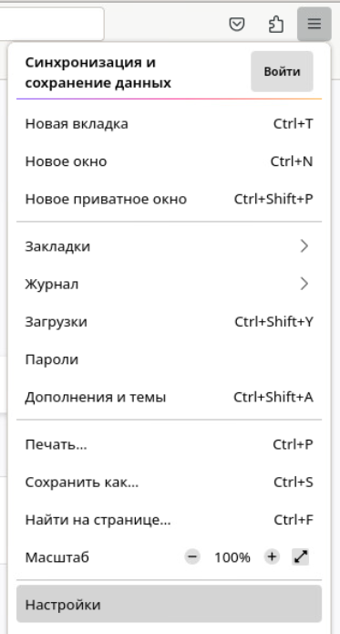
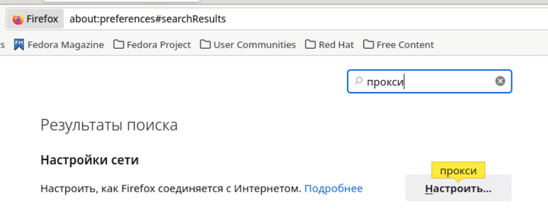
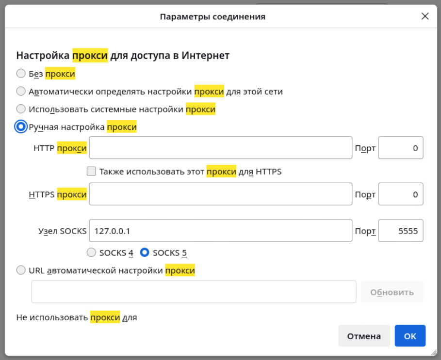
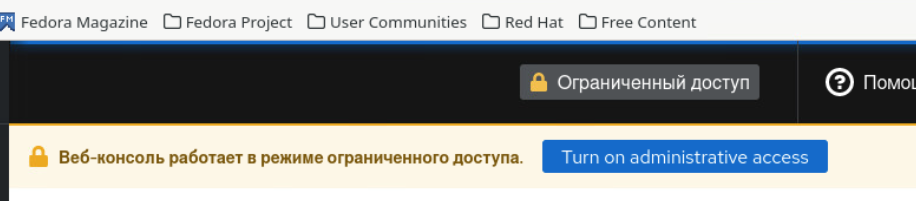
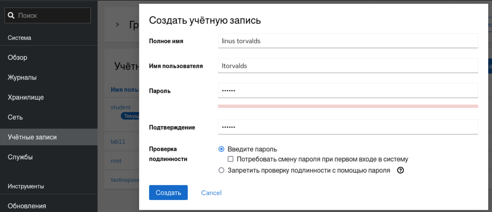

## LAB11-1. OpenSSH

1. Откройте файл конфигурации **sshd** /etc/ssh/sshd_config в редакторе.
```bash
vim /etc/ssh/sshd_config
``` 

2. Найдите строку **Port** и под этой строкой добавьте строку Port 2022. Это сообщает сервису **sshd**, что он должен связываться с двумя разными портами, что гарантирует, что вы все еще можете открывать сеансы **SSH**, даже если вы допустили ошибку.

3. Добавьте также строку в файл конфигурации **SSH**
```ini
AllowUsers student
```
4. Сохраните изменения в файле конфигурации и перезапустите **sshd**, используя 
```bash
systemctl restart sshd
```
```console
Job for sshd.service failed because the control process exited with error code.
See "systemctl status sshd.service" and "journalctl -xeu sshd.service" for details.
```

5. Введите 
```bash
systemctl status -l sshd
```
 а затем 
```bash
journalctl -xeu sshd.service
```

Вы увидите ошибку `«В разрешении отказано (permission denied)»` при попытке **SSH** подключиться к порту **2022**.
```console
░░ Начат процесс запуска юнита sshd.service.
апр 21 09:30:10 fedora1.test.local sshd[14411]: error: Bind to port 2022 on 0.0.0.0 failed: Permission denied.
апр 21 09:30:10 fedora1.test.local sshd[14411]: error: Bind to port 2022 on :: failed: Permission denied.
апр 21 09:30:10 fedora1.test.local systemd[1]: sshd.service: Main process exited, code=exited, status=255/EXCEPTION
░░ Subject: Unit process exited
░░ Defined-By: systemd
░░ Support: https://lists.freedesktop.org/mailman/listinfo/systemd-devel
░░
░░ An ExecStart= process belonging to unit sshd.service has exited.
░░
░░ The process' exit code is 'exited' and its exit status is 255.
апр 21 09:30:10 fedora1.test.local sshd[14411]: fatal: Cannot bind any address.
апр 21 09:30:10 fedora1.test.local systemd[1]: sshd.service: Failed with result 'exit-code'.
```

6. Введите следующую строку, чтобы применить правильную метку **SELinux** к порту **2022**:
```bash
semanage port -a -t ssh_port_t -p tcp 2022
```

7. Откройте брандмауэр для порта **2022**, используя команду `firewall-cmd` 
```bash
wirewall-cmd --add-port=2022/tcp
firewall-cmd --add-port=2022/tcp --permanent
```

8. Снова просмотрите состоянгие сервиса **sshd** 
```bash
systemctl status -l sshd
```
Вы увидите, что процесс sshd теперь прослушивает два порта.
```console
● sshd.service - OpenSSH server daemon
     Loaded: loaded (/usr/lib/systemd/system/sshd.service; enabled; preset: enabled)
     Active: active (running) since Fri 2023-04-21 09:37:54 MSK; 16s ago
       Docs: man:sshd(8)
             man:sshd_config(5)
   Main PID: 14573 (sshd)
      Tasks: 1 (limit: 4630)
     Memory: 1.3M
        CPU: 23ms
     CGroup: /system.slice/sshd.service
             └─14573 "sshd: /usr/sbin/sshd -D [listener] 0 of 10-100 startups"

апр 21 09:37:54 fedora1.test.local systemd[1]: Starting sshd.service - OpenSSH server daemon...
апр 21 09:37:54 fedora1.test.local sshd[14573]: Server listening on 0.0.0.0 port 2022.
апр 21 09:37:54 fedora1.test.local sshd[14573]: Server listening on :: port 2022.
апр 21 09:37:54 fedora1.test.local systemd[1]: Started sshd.service - OpenSSH server daemon.
```

9.  Попробуйте войти на свой **SSH-сервер** с другого сервера, используя `ssh -p 2022 student@[server_ip]`. После открытия пользовательской оболочки введите `su -` для получения **root-доступа**. Отключитесь от сессии пользователя **root**.

10. Создайте пару ключей для пользователя **student** (комманду выполнить без sudo) c помощью утилиты `ssh-keygen`, парольную фразу для ключа задавать не надо. 
```bash
ssh-keygen
```
```console
Generating public/private rsa key pair.
Enter file in which to save the key (/home/student/.ssh/id_rsa):
Enter passphrase (empty for no passphrase):
Enter same passphrase again:
Your identification has been saved in /home/student/.ssh/id_rsa
Your public key has been saved in /home/student/.ssh/id_rsa.pub
The key fingerprint is:
SHA256://9oGJuvaHPVelGTC2imcX67oqWns4i7Kha5MtoH0k4 student@fedora1.test.local
The key's randomart image is:
+---[RSA 3072]----+
|                 |
|                 |
|            .   .|
|         . = . o.|
| ..     S B   ..+|
|.oE      o ....o.|
| +o.      ...*...|
|o=. . . ..===.o..|
|=.oo.+o. *Bo+*=o.|
+----[SHA256]-----+
```

11. Скопируйте публичный ключ на сервер тренера (**ip-адрес** сервера вам будет дан перед началом лабораторной работы). На вопрос опродолжении подключения ответьте  `yes`.
```bash
ssh-copy-id student@A.B.C.D
```
```console
/usr/bin/ssh-copy-id: INFO: Source of key(s) to be installed: "/home/student/.ssh/id_rsa.pub"
The authenticity of host '172.16.110.146 (172.16.110.146)' can't be established.
ED25519 key fingerprint is SHA256:MQpf6tZNWVbyZZ8v/G3ZDdwNxx5vSqR+RTNTPcQscAo.
This key is not known by any other names
Are you sure you want to continue connecting (yes/no/[fingerprint])? yes
/usr/bin/ssh-copy-id: INFO: attempting to log in with the new key(s), to filter out any that are already installed
/usr/bin/ssh-copy-id: INFO: 1 key(s) remain to be installed -- if you are prompted now it is to install the new keys
student@172.16.110.146's password:

Number of key(s) added: 1

Now try logging into the machine, with:   "ssh 'student@172.16.110.146'"
and check to make sure that only the key(s) you wanted were added.
```
12.  Проверьте подключение к серверу тренера.  При подключении у вас не должен запрашиваться пароль.
ssh A.B.C.D

13. На сервере тренера найдите свой ключ в файле **.ssh/authorized_keys**
Используйте утилиту `grep`. Смотрите [решение](#13)


14. Скопируйте свой ключ в файл **.ssh/authorized_keys** учетной записи **testnopass**
Используйте утилиты `grep`, `tee`, `sudo`. Смотрите [решение](#14)


15. Отключитесь от сервера тренера 
```bash
exit
```

16. Подключитесь снова к серверу тренера под учетной записью testnopass Подключение должно быть успешным. Посмотрите текущие подключения на сервере.
```bash
w -f
```
>
***Cделайте скриншот экрана c результатом выполнения задания для отправки отчета.***

17. Отключитесь от сервера

18. Откройте графический терминал на рабочем столе своей ВМ. Подключитесь к серверу тренера под учетной записью **testnopass** с пробросом графической сессии через туннель (исполбзуйте ключ **-X**). Смотрите [решение](#15)

19. Запустите через терминал приложение 'kate' на удаленной машине, должно открыться приложение в вашей графической сессии.

20. В открывшемся приложении `kate` создайте новый файл и вставьте в него текст, содержащий вашу фамилию.

21. Сохраните файл назвав его своей фамилией. Закройте текстовый редактор `kate`.

22. Посмотрите список файлов в домашнем каталоге пользователя **testnopass**, убедитесь что там есть ваш файл. Сделайте скриншот списка файлов.
>
***Cделайте скриншот экрана c результатом выполнения задания для отправки отчета.***

23. Переподключитесь к серверу тренера с пробросом динамического порта (исполбзуйте ключ **-D** и номер порта). Смотрите [решение](#23) 


24. Настройте в браузере firefox soks-proxy 
+ Шаг 1.



+ Шаг 2.



+ Шаг 3.



25.   Перейдите в браузере на страницу cockpit ВМ тренера по адресу https://A.B.C.D:9090

26. Переключитесь в режим администрирования и попробуйте создать учетную запись для своего пользователя (используйте свои имя и фамилию)

+ Шаг 1.

  

+ Шаг 2.



27. После удачного создания учетной записи, найдите ее в списке пользователей и сделайте скриншот.
>
***Cделайте скриншот экрана c результатом выполнения задания для отправки отчета.***

28. Отключитесь от сервера.

29. Верните настройку sshd-сервиса в первоначальное состояние: ssh должен снова подключаться по порту 22. Для этого достаточно удалить стороку с упоминанием порта 2022 и перезапустить сервис.

### Ответы:
##### 13

```bash
grep student@fedora1 .ssh/authorized_keys
```
```console
ssh-rsa AAAAB3NzaC1yc2EAAAADAQABAAABgQDHhbAteyLVmLPGqXPPUW5UmpeDYW/+WLQsC2fGY3gHyruV/
OQq2TQvzJHXoziIfx6FQwItsJHOAOn8kucDrddZ7kbEcjnt5D5MIbOJXkFjC+XnGPSnUO/
9V4HKwYzHblwccJvMY2LGCrJomCYYcVzg9SX2th7DoNmzFJ2SIw99jIRw5qk5c4X6pCWCSKz9uTVo/
W0Pmv5Zyht8IRantjJwLG5naFNcPh4yhT7PdwZ4UiVS2iSE5mwfA4KJv9kdpmY2Y6ew7FNoXFzyplJsIWeyKd
fcvbBJRr6q33kkoZhIOGk/
4yYjJ8bMP9QlhdUmNOaw88PgKOywVV3M3xewOHsrXYeIJ1ipkJVsfqk1jO2Fu8RgePcaq6zrnPTgN35oSmseg
fmmqDWAU3ZERRfdFQktehLFlfegxCUe6oKBAjUCPt32TAwFRHk2H1nfImVhwnBA'+97YQlczUfDH2MKkfbKCw4RiXGCfT5OTH8WTl3ksyfWx1b2xgCD1ADCViW3CgQ0
= student@fedora1.test.local
```
##### 14
```bash
grep student@fedora1 .ssh/authorized_keys |sudo tee -a /home/testnopass/.ssh/authorized_keys
```

##### 15
```bash
ssh testnopass@A.B.C.D -X
```

##### 23
```bash
ssh testnopass@A.B.C.D -D 5555
```
